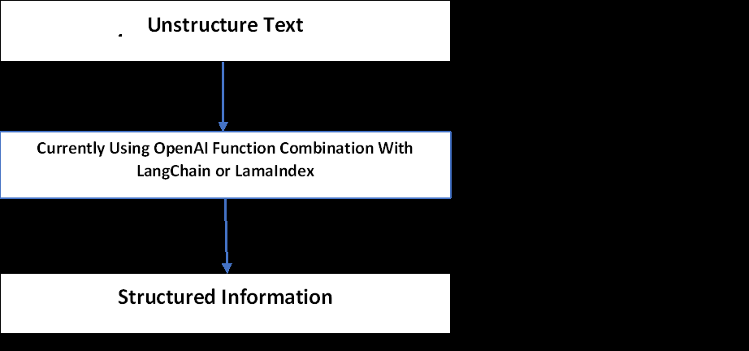
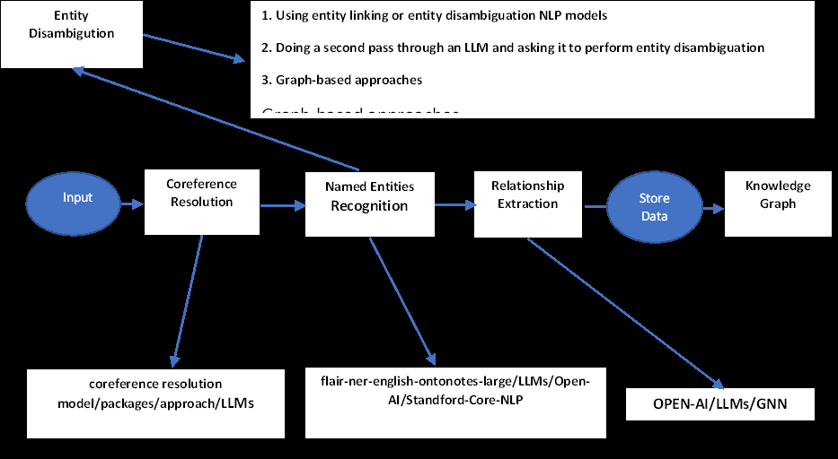

# Information-retrival-with-both-knowledgeGraphndex-and-vectorIndex
In this repo I implemented jupyter notebook  for information extraction with using KnowledgeGraphIndex, VectorIndex and LamaIndex

During the development of the Knowledge Graph for the  information Extraction pipeline, we encountered challenges at various stages of the pipeline, as outlined below:
Generic Cypher Query generation from natural query or text:
Problem: We are facing challenges in formulating a generic Cypher query that can effectively retrieve relevant information from our knowledge graph.
Explanation: Crafting a query that is versatile enough to adapt to various data structures and relationships within the knowledge graph is crucial. The struggle lies in creating a query that strikes a balance between specificity and generality.
Building a Knowledge Graph from Contracts:
Problem: We are encountering difficulties in the process of extracting and organizing information from contracts to construct a comprehensive knowledge graph.
Explanation: The complexity of legal language and varied contract structures poses a hurdle in the extraction and representation of meaningful entities and their relationships. Determining the optimal approach to translate legal text into a structured format for the knowledge graph is a significant challenge.
Leveraging Existing Ontologies for Relationship Acceleration:
Problem: We are exploring ways to efficiently leverage existing ontologies to expedite the establishment of relationships within our knowledge graph.
Explanation: Integrating external ontologies seamlessly into our knowledge graph requires careful consideration of compatibility and alignment. The challenge lies in identifying and adopting relevant ontologies that align with our domain, as well as mapping and connecting them effectively to enhance relationship inference.

LLMs have revolutionized information extraction from unstructured text. The image illustrates the information extraction pipeline, turning text into a knowledge graph. Nodes represent entities, and connections show relationships. Knowledge graphs are handy for various tasks. Despite LLMs making extraction more accessible, challenges remain. We'll use OpenAI functions and LangChain to build a knowledge graph, discussing best practices and LLM limitations along

Neo4j and Nebula is a graph database management system that is designed to efficiently store, manage, and query graph data. In the context of the paragraph you provided, the focus is on setting up instances of Neo4j for the purpose of creating a Knowledge Graph.
Now, let's break down the paragraph with a bit more explanation:
Context: Neo4j and Nebula is the chosen platform for building the Knowledge Graph. It's a powerful tool specifically designed to handle relationships and connections within data, making it ideal for representing complex networks of information.
Explanation of the Paragraph: The simplest method involves initiating a free instance on Neo4j Aura and Nebula, which provides cloud instances of the Neo4j database. Neo4j Aura is a cloud service

provided by Neo4j. It allows users to create and manage Neo4j database instances in the cloud. The term free instance implies that there is an option to get started without incurring immediate costs.
"Alternatively, we can set up a local instance of the Neo4j database by downloading the Neo4j Desktop application and creating a local database instance."
Alternatively, if a cloud-based solution is not preferred or applicable, users can opt for a local installation. This involves downloading the Neo4j Desktop application, a user-friendly interface for managing Neo4j databases, and creating a database instance on the user's local machine.
In summary, the paragraph outlines two approaches for setting up Neo4j instances: one on the cloud using Neo4j Aura and another locally using the Neo4j Desktop application. The choice between them depends on factors such as convenience, resource requirements, and project specifications.

In this notebook I try to used both knowledge-graph and vectorDb along with LamaIndex Framework to extract information

                                         
